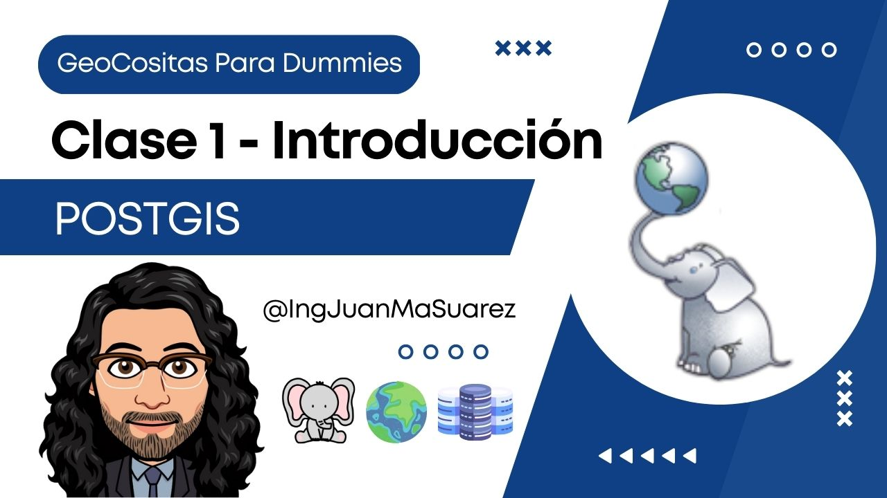

# PostGIS para Dummies

## Curso para aprender PostGIS usando el lenguaje SQL desde cero y para principiantes

## Clases en vídeo

### Curso de fundamentos desde cero

Curso que agrupa todas las clases que hacen referencia a los fundamentos de PostGIS.

> Código: Todo el código se encuentra en la raiz de este repositorio de Github

* [Lección 1 - Introducción](https://youtu.be/oVEUcYKemXQ)
* [Lección 2 - Cargar Datos](https://youtu.be/Exf_oKPRr4g)
* [Lección 3 - Funciones](https://youtu.be/IMrqjfKLgwQ)
* [Lección 4 - Análisis](https://youtu.be/jVlR9_qkM8c)
* [Lección 5 - Ráster](https://youtu.be/Jeb6FXCt9Bs)
* [Lección 6 - Análisis Ráster](https://youtu.be/Cq32JRkb_5s)

## Información importante y preguntas frecuentes

Actualmente el curso está finalizado. Se han realizado varios ejercicios prácticos y se explican varios conceptos espaciales, ese era el objetivo inicial del proyecto.

No descarto añadir nuevas lecciones a futuro, pero creo que por el momento puede servir de base a cualquier persona que quiera empezar a aprender PostGIS.

* En el momento que el curso continúe, actualizaré el repositorio y avisaré en redes.

¡Muchísimas gracias por todo el apoyo mostrado!

## Enlaces de interés

* [Web oficial de PostgreSQL](https://www.postgresql.org/)
* [Web oficial de PostGIS](https://postgis.net/)

#### Puedes apoyar mi trabajo haciendo "☆ Star" en el repo o nominarme a "GitHub Star". ¡Gracias!

